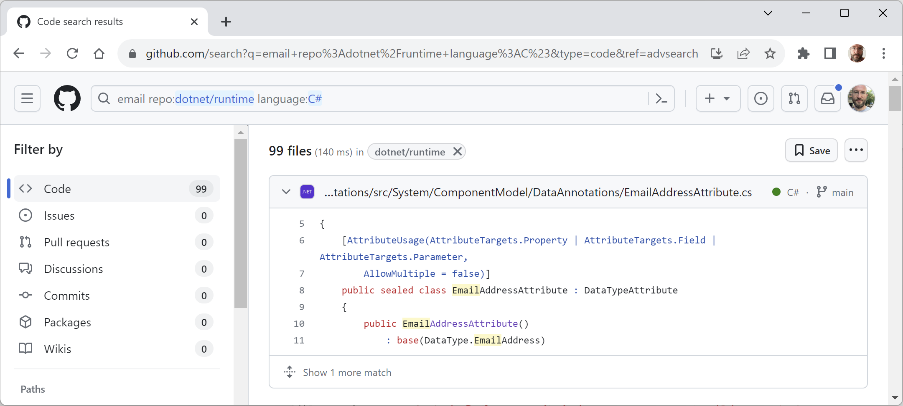
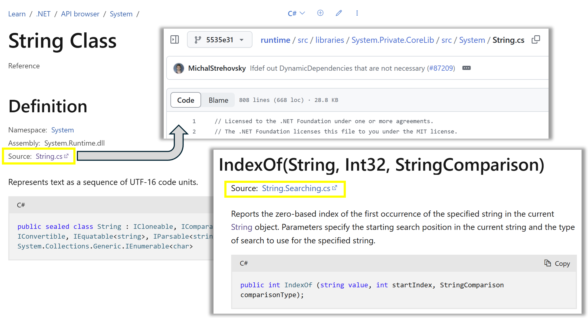

# Source Code

Sometimes, you can learn a lot from seeing how the Microsoft teams have implemented .NET by reading source code. 

## Searching the .NET source code

The source for the entire code base for .NET is available in public GitHub repositories. For example, you might know that there is a built-in attribute to validate an email address.

Let’s search the repositories for the word “email” and see if we can find out how it works:
1.	Use your preferred web browser to navigate to https://github.com/search.
2.	Click **advanced search**.
3.	In the search box, type `email`.
4.	In the **In these respositories** box, type `dotnet/runtime`. (Other repositories that you might want to search include `dotnet/core`, `dotnet/aspnetcore`, `dotnet/wpf`, and `dotnet/winforms`.)
5.	In the **Written in this language** box, select **C#**.
6.	At the top right of the page, note how the advanced query has been written for you. Click **Search**, then the **Code** filter, and note that the results include `EmailAddressAttribute`, as shown in *Figure 1.15*:


*Figure 1.15: Advanced search for email in the dotnet/runtime repository*

7.	Click the source file, and note that it implements email validation by checking that the string value contains an @ symbol but not as the first or last character, as shown in the following code:
```cs
// only return true if there is only 1 '@' character
// and it is neither the first nor the last character
int index = valueAsString.IndexOf('@');
return
    index > 0 &&
    index != valueAsString.Length - 1 &&
    index == valueAsString.LastIndexOf('@');
```
8.	Close the browser.

For your convenience, you can do a quick search for other terms by replacing the search term email in the following link: https://github.com/search?q=%22email%22+repo%3Adotnet%2Fruntime+language%3AC%23&type=code&ref=advsearch.

## Source code in documentation

When you read API reference documentation, you often want to review the actual source code. For .NET APIs that have **Source Link** enabled, have an accessible PDB, and are hosted in a public GitHub repository, links to source code are included in the definition metadata. 

For example, the `String` class documentation page now has this new **Source link**, and its IndexOf method has a Source link to another of its source files, as shown in **Figure 1.16**:


*Figure 1.16: Documentation with links to source files*

You can read more about how the Microsoft team achieved this in the article **Introducing links to source code for .NET API Docs**, found at the following link: https://devblogs.microsoft.com/dotnet/dotnet-docs-link-to-source-code/.
