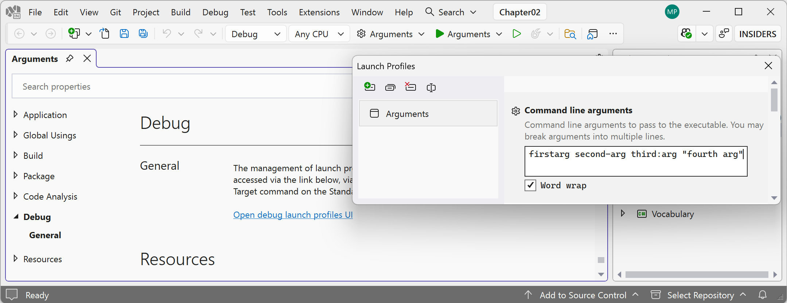
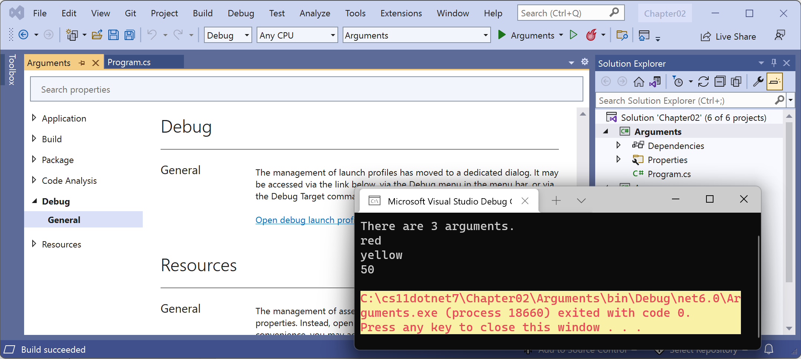
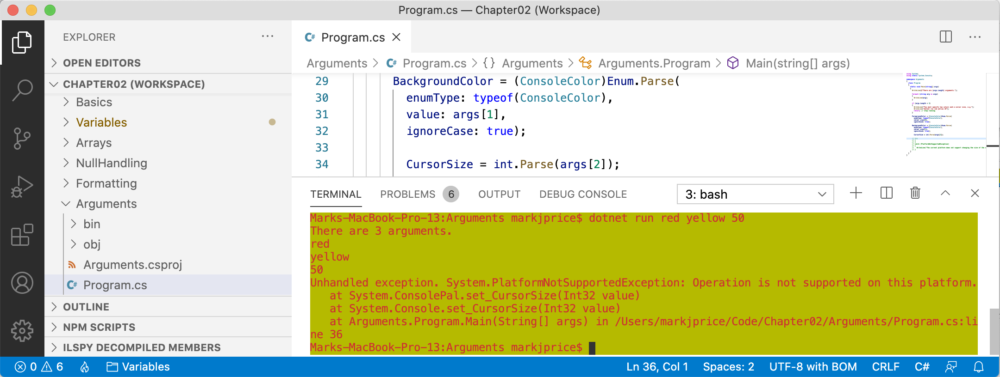

- [Passing arguments to a console app](#passing-arguments-to-a-console-app)
- [Setting options with arguments](#setting-options-with-arguments)


# Passing arguments to a console app

When you run a console app, you often want to change its behavior by passing arguments. For example, with the `dotnet` command-line tool, you can pass the name of a new project template:
```shell
dotnet new console
dotnet new mvc
```

You might have been wondering how to get any arguments that might be passed to a console app.

In every version prior to .NET 6, the console app project template made it obvious:
```cs
using System;

namespace Arguments
{
  class Program
  {
    static void Main(string[] args)
    {
      Console.WriteLine("Hello World!");
    }
  }
}
```

The `string[] args` arguments are declared and passed in the `Main` method of the `Program` class. They’re an array used to pass arguments into a console app. But in top-level programs, as used by the console app project template in .NET 6 and later, the `Program` class and its `Main` method are hidden, along with the declaration of the `args` array. The trick is that you must know it still exists.

Command-line arguments are separated by spaces. Other characters, such as hyphens and colons, are treated as part of an argument value.

To include spaces in an argument value, enclose the argument value in single or double quotes.

Imagine that we want to be able to enter the names of some colors for the foreground and background, and the dimensions of the terminal window at the command line. We would be able to read the colors and numbers by reading them from the `args` array, which is always passed into the `Main` method, aka the entry point of a console app:

1.	Use your preferred code editor to add a new **Console App** / `console` project named `Arguments` to the `Chapter02` solution.
2.	In the `Arguments.csproj` project file, after the `<PropertyGroup>` section, add a new `<ItemGroup>` section to statically import `System.Console` for all C# files using the implicit using .NET SDK feature:
```xml
<ItemGroup>
  <Using Include="System.Console" Static="true" />
</ItemGroup>
```

> **Good practice**: Remember to use the implicit using .NET SDK feature to statically import the `System.Console` type in all future console app projects to simplify your code, as these instructions will not be repeated every time.

3.	In `Program.cs`, delete the existing statements and then add a statement to output the number of arguments passed to the application:
```cs
WriteLine($"There are {args.Length} arguments.");
```

4.	Run the console app and view the result:
```text
There are 0 arguments.
```

If you are using Visual Studio:
1.	Navigate to **Project** | **Arguments Properties**. Alternatively, in **Solution Explorer**, right-click the **Arguments** project and select **Properties**, or select the **Arguments** project and press *Alt* + *Enter*.
2.	In the left navigation bar, select the **Debug** tab, click **Open debug launch profiles UI**, and in the **Command line arguments** box, enter the following arguments: `firstarg second-arg third:arg "fourth arg"`, as shown in *Figure 2.11*:

 
*Figure 2.11: Entering command-line arguments in the Visual Studio project properties*

3.	Close the **Launch Profiles** window.
4.	In **Solution Explorer**, in the **Properties** folder, open the `launchSettings.json` file and note it defines the command-line arguments when you run the project, as shown in the following configuration:
```json
{
  "profiles": {
    "Arguments": {
      "commandName": "Project",
      "commandLineArgs": "firstarg second-arg third:arg \"fourth arg\""
    }
  }
}
```

> The `launchSettings.json` file can also be used by Rider. The equivalent for VS Code is the `.vscode/launch.json` file.

5.	Run the console app project.

If you are using VS Code, then in **Terminal**, enter some arguments after the `dotnet run` command:
```shell
dotnet run firstarg second-arg third:arg "fourth arg"
```

For all code editors:
1.	Note that the result indicates four arguments:
```
There are 4 arguments.
```
2.	In `Program.cs`, to enumerate or iterate (that is, loop through) the values of those four arguments, add the following statements after outputting the length of the array:
```cs
foreach (string arg in args)
{
  WriteLine(arg);
}
```

3.	Run the code again and note that the result shows the details of the four arguments:
```
There are 4 arguments.
firstarg
second-arg
third:arg
fourth arg
```

# Setting options with arguments

We will now use these arguments to allow the user to pick a color for the background, foreground, and cursor size of the output window. The cursor size can be an integer value from 1, meaning a line at the bottom of the cursor cell, up to 100, meaning a percentage of the height of the cursor cell.

We have statically imported the `System.Console` class. It has properties such as `ForegroundColor`, `BackgroundColor`, and `CursorSize` that we can now set just by using their names without needing to prefix them with `Console`.

The `System` namespace is already imported so that the compiler knows about the `ConsoleColor` and `Enum` types:

- Add statements to warn the user if they do not enter three arguments, and then parse those arguments and use them to set the color and dimensions of the console window:
```cs
if (args.Length < 3)
{
  WriteLine("You must specify two colors and cursor size, e.g.");
  WriteLine("dotnet run red yellow 50");
  return; // Stop running.
}

ForegroundColor = (ConsoleColor)Enum.Parse(
  enumType: typeof(ConsoleColor),
  value: args[0], ignoreCase: true);

BackgroundColor = (ConsoleColor)Enum.Parse(
  enumType: typeof(ConsoleColor),
  value: args[1], ignoreCase: true);

CursorSize = int.Parse(args[2]);
```

Note the compiler warning that setting `CursorSize` is only supported on Windows. For now, do not worry about most of this code, such as `(ConsoleColor)`, `Enum.Parse`, or `typeof`, as it will all be explained in the next few chapters.

- If you are using Visual Studio, change the arguments to `red yellow 50`. Run the console app and note that the cursor is half the size and the colors have changed in the window, as shown in *Figure 2.12*:

 
*Figure 2.12: Setting colors and cursor size on Windows*

- If you are using VS Code, then run the code with arguments to set the foreground color to red, the background color to yellow, and the cursor size to 50%:
```shell
dotnet run red yellow 50
```

On macOS or Linux, you’ll see an unhandled exception, as shown in *Figure 2.13*:


*Figure 2.13: An unhandled exception on unsupported macOS*

Although the compiler did not give an error or warning, at runtime, some API calls may fail on some platforms. Although a console app running on Windows can change its cursor size, on macOS, it cannot, and it complains if you try.

So how do we solve this problem? We can solve this by using an exception handler. You will learn more details about the `try-catch` statement in *Chapter 3, Controlling Flow, Converting Types, and Handling Exceptions*. You can also learn how to avoid these exceptions in another optional online task, *Handling platforms that do not support an API*.
