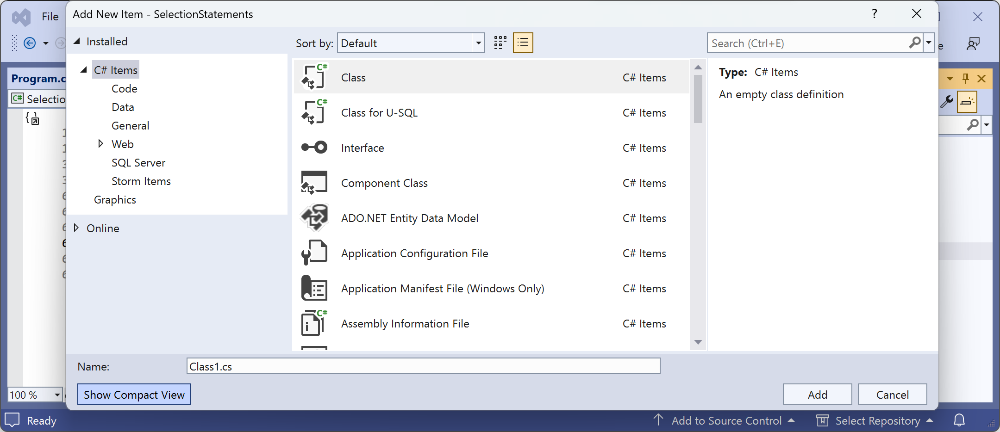
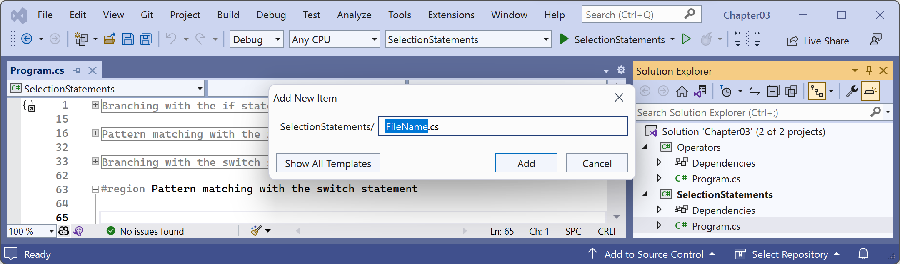

# Adding a new item to a project using Visual Studio

Visual Studio version 17.6 or later has an optional simplified dialog box for adding a new item to a project. 

After navigating to **Project** | **Add New Item…**, or right-clicking on a project in **Solution Explorer** and selecting **Add** | **New Item…**, you will probably see the traditional dialog box, as shown in *Figure 3.1*:

*Figure 3.1: Add New Item dialog box in normal view*

If you click the *Show Compact View* button, then it switches to a simplified dialog box, as shown in *Figure 3.2*:

 
*Figure 3.2: Add New Item dialog box in compact view*

To revert to the normal dialog box, click the **Show All Templates** button.
