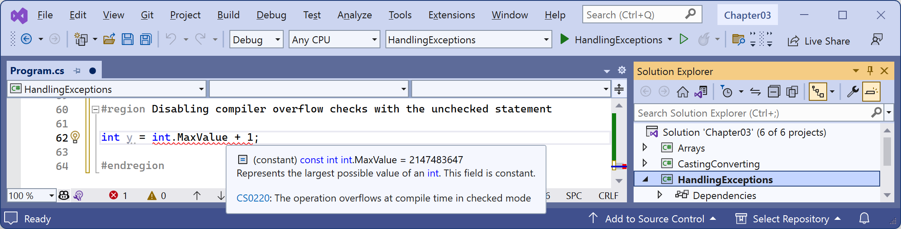

- [Checking for overflow](#checking-for-overflow)
  - [Throwing overflow exceptions with the checked statement](#throwing-overflow-exceptions-with-the-checked-statement)
  - [Disabling compiler overflow checks with the unchecked statement](#disabling-compiler-overflow-checks-with-the-unchecked-statement)

# Checking for overflow

Earlier, we saw that when casting between number types, it was possible to lose information, for example, when casting from a `long` variable to an `int` variable. If the value stored in a type is too big, it will *overflow*.

## Throwing overflow exceptions with the checked statement

The `checked` statement tells .NET to throw an exception when an overflow happens instead of allowing it to happen silently, which is done by default for performance reasons.

We will set the initial value of an `int` variable to its maximum value minus one. Then, we will increment it several times, outputting its value each time. Once it gets above its maximum value, it overflows to its minimum value and continues incrementing from there.

Let’s see this in action:
1.	In `Program.cs`, type statements to declare and assign an integer to one less than its maximum possible value, and then increment it and write its value to the console three times:
```cs
int x = int.MaxValue - 1;
WriteLine($"Initial value: {x}");
x++;
WriteLine($"After incrementing: {x}");
x++;
WriteLine($"After incrementing: {x}");
x++;
WriteLine($"After incrementing: {x}");
```

2.	Run the code and view the result that shows the value overflowing silently and wrapping around to large negative values:
```
Initial value: 2147483646
After incrementing: 2147483647
After incrementing: -2147483648
After incrementing: -2147483647
```

3.	Now, let’s get the runtime to warn us about the overflow by wrapping the statements using a `checked` statement block:
```cs
checked
{
  int x = int.MaxValue - 1;
  WriteLine($"Initial value: {x}");
  x++;
  WriteLine($"After incrementing: {x}");
  x++;
  WriteLine($"After incrementing: {x}");
  x++;
  WriteLine($"After incrementing: {x}");
}
```

4.	Run the code and view the result that shows the overflow being checked and causing an exception to be thrown:
```
Initial value: 2147483646
After incrementing: 2147483647
Unhandled Exception: System.OverflowException: Arithmetic operation resulted in an overflow.
```

5.	Just like any other exception, we should wrap these statements in a `try` statement block and display a nicer error message for the user:
```cs
try
{
  // previous code goes here
}
catch (OverflowException)
{
  WriteLine("The code overflowed but I caught the exception.");
}
```
6.	Run the code and view the result:
```
Initial value: 2147483646
After incrementing: 2147483647
```

The code overflowed but I caught the exception.

## Disabling compiler overflow checks with the unchecked statement

The previous section was about the default overflow behavior at runtime and how to use the `checked` statement to change that behavior. This section is about compile-time overflow behavior and how to use the unchecked statement to change that behavior.

A related keyword is `unchecked`. This keyword switches off overflow checks performed by the compiler within a block of code. Let’s see how to do this:

1.	Type the following statement at the end of the previous statements. The compiler will not compile this statement because it knows it will overflow:
```cs
int y = int.MaxValue + 1;
```

2.	Hover your mouse pointer over the error, and note that a compile-time check is shown as an error message, as shown in *Figure 3.4*:

 
*Figure 3.4: A compile-time check for integer overflow*

3.	To disable compile-time checks, wrap the statement in an `unchecked` block, write the value of `y` to the console, decrement it, and repeat, as shown in the following code:
```cs
unchecked
{
  int y = int.MaxValue + 1;
  WriteLine($"Initial value: {y}");
  y--;
  WriteLine($"After decrementing: {y}");
  y--;
  WriteLine($"After decrementing: {y}");
}
```

4.	Run the code and view the results:
```
Initial value: -2147483648
After decrementing: 2147483647
After decrementing: 2147483646
```

Of course, it would be rare that you would want to explicitly switch off a check like this because it allows an overflow to occur. But perhaps you can think of a scenario where you might want that behavior.

> **Prompt**: Please explain `checked` and `unchecked` integer overflow in C#. Show what happens at compile time and runtime and explain when overflow could become a security or correctness problem.

> **Good practice**: Use a `checked` context when converting externally supplied or calculated values to a smaller numeric type. An `unchecked` narrowing conversion can silently discard significant bits and produce a plausible but incorrect value.
