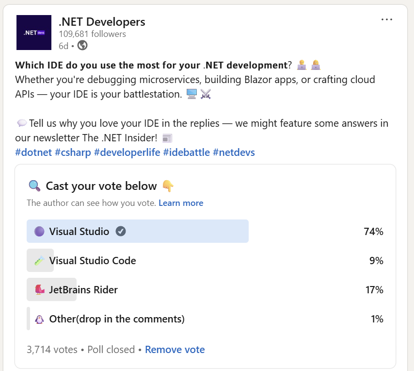

# Code Editors
- [Visual Studio for Windows](vs.md)
- [VS Code for Windows, Mac, or Linux](vscode.md)
- [JetBrains Rider for Windows, Mac, or Linux](rider.md)

> JetBrains Rider is free for non-commercial use: https://blog.jetbrains.com/blog/2024/10/24/webstorm-and-rider-are-now-free-for-non-commercial-use/.

> **Warning!** Visual Studio for Mac reached its end-of-life in August 2024. You can read the retirement announcement at the following link: https://devblogs.microsoft.com/visualstudio/visual-studio-for-mac-retirement-announcement/.

## Surveys of code editors

The **.NET Developers** community on LinkedIn was surveyed in May 2025 and they confirm that Visual Studio is still the most used IDE:

